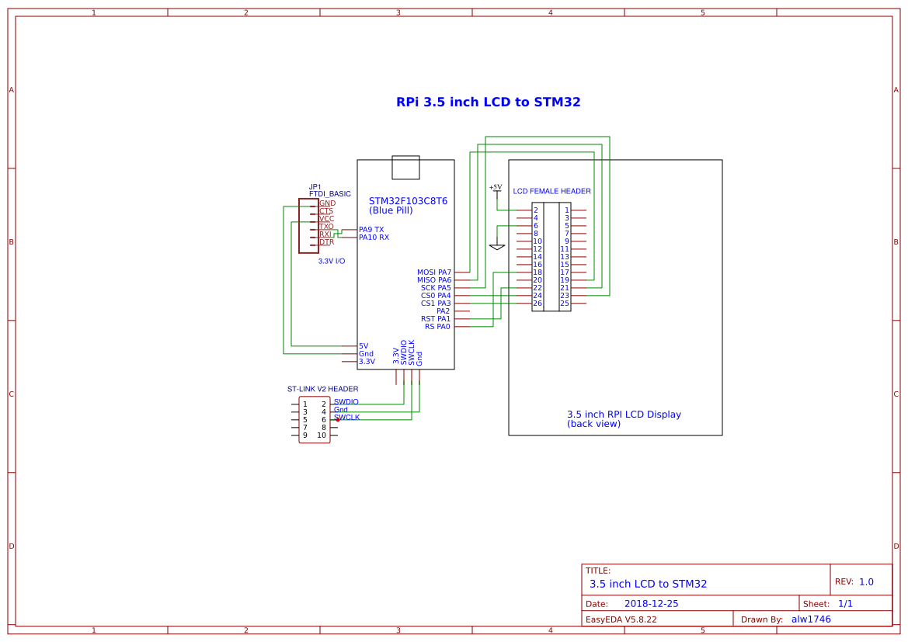

# RPI-LCD-STM32
Interface a Raspberry Pi 3.5 inch LCD to an STM32F103C8T6 (blue pill) with stm32duino and SPI. The LCD  normally plugs into the RPi's GPIO header(pin 1-26) via a short female header on the back of the display. But in this case, jumper wires are used to connect the 2 devices together. LCD driver software are used together with Arduino sketches to test and show the  workings of the LCD.  
  
  
## Wiring diagram
  

The female header is numbered according to layout below(view from back of display). They correspond directly to the GPIO header pins on a Raspberry Pi board when plugged together.

      2   1
      4   3
      :   :
     26  25

### Pin Connections
|STM32 Pin|LCD Skt|Name |
|---------|-------|-----|
|5V       |2      |5V   |
|GND      |6      |GND  |
|PA0      |18     |RS   |
|PA7      |19     |MOSI |
|PA6      |21     |MISO |
|PA1      |22     |RST  |
|PA5      |23     |SCK  |
|PA4      |24     |CS0  |
|PA3      |26     |CS1  |  

The FTDI USB-serial adapter is only used for debug output.  
  

Redirect Serial to Serial1 in the application sketches.

  **#define Serial Serial1**

The STM32 is programmed using a cheap ST-Link device found in ebay.

### Configure the Arduino IDE with STLink as the upload method.

Board: Generic STM32F103C series  
Variant: STM32F103C8 (20k RAM. 128k Flash)  
CPU Speed(MHZ): 72Mhz (Normal)  
Upload method: STLink

## Software Installation
### STM32duino
- STM32duino is an Arduino Core for the Maple Mini and other STM32 F1 and F4 boards.
- See https://wiki.stm32duino.com/index.php?title=Installation for installation details.
### Adafruit GFX library
- Install from the Arduino IDE library manager.
### Adafruit ILI9486 STM32 driver
- Clone https://github.com/alw1746/Adafruit_ILI9486_STM32 and unzip to your .../Arduino/libraries folder.
- Customise Adafruit_ILI9486_STM32.h according to your wiring diagram.  
  **//Control pins |RS |CS |RST|  
  #define TFT_CNTRL      GPIOA  
  #define TFT_RST        PA1  
  #define TFT_RS         PA0  
  #define TFT_CS         PA4**

### XPT2046 touchscreen driver
- Clone https://github.com/alw1746/XPT2046_Touchscreen and unzip to your .../Arduino/libraries folder.

### Arduino Sketches
The sketches should be run in the following order to test and obtain information about the LCD.

1. **[graphicstest.ino](https://github.com/alw1746/Adafruit_ILI9486_STM32/examples/graphicstest/graphicstest.ino)** - generate test patterns on the LCD. This verifies LCD-STM32 wiring is correct. If you get a white screen there is a mixup in the wiring, loose connections, insufficient power, etc.  

2. **[LCDcalibrate.ino](https://github.com/alw1746/XPT2046_Touchscreen/examples/LCDcalibrate/LCDcalibrate.ino)** - obtain the screen boundary(x,y) and touch pressure(z) extrema of the LCD by poking the top left/bottom right  corners of the LCD with low/high strength. Home(0,0) is the top left corner in landscape mode, X-axis is the top edge and Y-axis is the left edge. Change the pin definition if required:  

   **#define CS_PIN  PA3**

3. **[TSpaint,ino](https://github.com/alw1746/XPT2046_Touchscreen/examples/TSpaint/TSpaint.ino)** - enhanced version of Adafruit's touchpaint for fun. Plug in values returned by the XPT2046 controller. The XY values are mapped by the code to pixel coordinates(480x320). Z values(pressure) are used to vary  pen's stroke width. The heavier the pressure, the wider the stroke.

   **#define TS_CS_PIN PA3  
   #define TS_MINX 180  
   #define TS_MINY 250  
   #define TS_MAXX 3900  
   #define TS_MAXY 3900  
   #define TS_MINZ 800  
   #define TS_MAXZ 2000**

